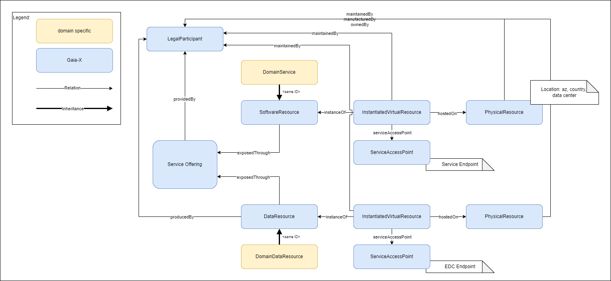

# Gaia-X compliant claims example

## Introduction
This repository contains an overview of how to specify Gaia-X compliant claims. The claims are based on the Vocabulary defined in the [Gaia-X Trust Framework Model 2210](https://registry.lab.gaia-x.eu/v1/api/trusted-shape-registry/v1/shapes/jsonld/trustframework#).

## Gaia-X Trust Framework
The Gaia-X Trust Framework consists of several classes and their attributes. These classes are used to describe the service or data that should be offered. We call that metadata. Here are the most relevant classes needed for creating basic claims:

### Overview of basic classes and their attributes


### Model
The following diagrams provide a visual representation of the classes and how they are linked together.

#### Model for DataResource and SoftwareResource


This example shows a `ServiceOffering` which is provided by a certain `LegalParticipant`. In this example the `ServiceOffering` links a `SoftwareResource` as well as a `DataResource` with the `exposedThrough` relation. 

---
**Notes:** 
- Please note that a `ServiceOffering` can link only one of the `Resource`s **or** even more depending on the use case that should be described.
- There can be domain specific extensions to describe a ServiceOffering or a DataResource in more details (here: `DomainService` and `DomainDataResource`. Those domain specific subclasses are defined in the [ontology-management repository](https://github.com/GAIA-X4PLC-AAD/ontology-management-base) and loaded into the [federated catalogue](https://gitlab.eclipse.org/eclipse/xfsc/cat/fc-service).
---

The `DataResource` or `SoftwareResource` are linked to the `InstanciatedVirtualResource` with the `instanceOf` relation. The `ServiceAccessPoint` then defines the EDC endpoint address or the service endpoint URL.

The `PhysicalResource` describes the infrastructure where the Resource is hosted and links back to the `LegalParticipant` with the relations `maintainedBy`, `manufacturedBy` and `ownedBy`.

## Claims
The [Model](#model) defines the classes and their dependencies needed to create a metadata description of the service or data to be offered. 

'Claims' means the instantiation of the model into a concrete instance representing the metadata. 
In Gaia-X these claims are encapsulated into a [W3C VerifiableCredential](https://www.w3.org/TR/vc-data-model/) and a [W3C VerifiablePresentation](https://www.w3.org/TR/vc-data-model/) both having a proof (signature). Those VerifiablePresentations can be sent to the [federated catalogue](https://gitlab.eclipse.org/eclipse/xfsc/cat/fc-service) which is responsible for storing that meta data description and making it discoverable.

The `src` directory contains an example for claims for the specific classes mentioned above. You can find more details in the respective claim files in the `src` directory.

---
**Note:** 
The claims provided as an example could look different. In some cases the [Gaia-X Trust Framework Model 2210](https://registry.lab.gaia-x.eu/v1/api/trusted-shape-registry/v1/shapes/jsonld/trustframework#) allows different approaches to describe the data, e. g. with `sh:or`. 

Example:
```
[ 
    sh:name "copyright owned by" ;
    sh:or ( [ sh:class gx:LegalParticipant ] [ sh:datatype xsd:string ] ) ;
],
```
This means that one can link a list of `LegalParticipant` class to this object **or** just provide a simple strings.

The example claims can only show one of the possibilities. Please refer to the [Gaia-X Trust Framework Model 2210](https://registry.lab.gaia-x.eu/v1/api/trusted-shape-registry/v1/shapes/jsonld/trustframework#) for more details. 

---

### Disclaimer
There are some problems resulting of the current version of the  [Gaia-X Trust Framework Model 2210](https://registry.lab.gaia-x.eu/v1/api/trusted-shape-registry/v1/shapes/jsonld/trustframework#):

- The relation `exposedThrough` is currently not modelled correctly. `exposedThrough` should point to the data exchange component as written in the specification. This will be fixed in the next version of the Gaia-X Trust Framework. `exposedThrough` will then link to the data exchange component and the relationship between `ServiceOffering` and the `Resource` will be replaced by `aggregationOf`.
- There is a similar issue in the `ServiceOfferingShape`. The relation `providedBy` is modelled as sh:node which means that we cannot link an existing participant by its ID. We expect hat this will be changed in future so a participant can be linked like in `DataResourceShape.producedBy` property with `sh:class` and `sh:nodeKind sh:IRI`.
- Another issue in the `ServiceOfferingShape` is that the `LegalParticipant` is not linked correctly. `providedBy` defines a `sh:node gx:LegalParticipant` and not `sh:node gx:LegalParticipantShape`. As stated above the recommendation would be to link  with `sh:class` and `sh:nodeKind sh:IRI`. 
- Regarding InstantiatedVirtualResource, the `hostedOn` and `instanceOf` attributes are not modelled as sh:nodeKind sh:IRI as it can be seen in the other attributes like `maintainedBy`, `manufacturedBy` and `ownedBy`. For that reason we cannot use an IRI and link existing nodes but we need to embed the `PhyicalResource` and the `DataResource` directly into the `InstantiatedVirtualResource`. See `InstanciatedVirtualResource-instance_adapted.json` for an example.
- The `LegalParticipant` credential referenced in the Trust Framework 22.10 obviously has a different shape than the one that is accepted by the current [Compliance Service](https://compliance.lab.gaia-x.eu/main/docs). 
  - The LegalParticipant-instance_20.10-conform.json is a version that is **not accepted** by the Compliance Service but relates to the LegalParticipantShape. 
  - The LegalParticipant-instance_compliance-service-conform.json is a version that is **accepted** by the Compliance Service but does not relate to the LegalParticipantShape. 
  - Please consult the README.md in ./src/LegalParticipant for more information.

These problems should be fixed in the next version of the Gaia-X Trust Framework.

## License
see [LICENSE](LICENSE.md)

